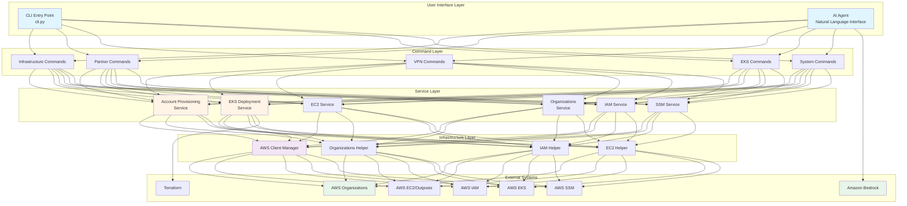
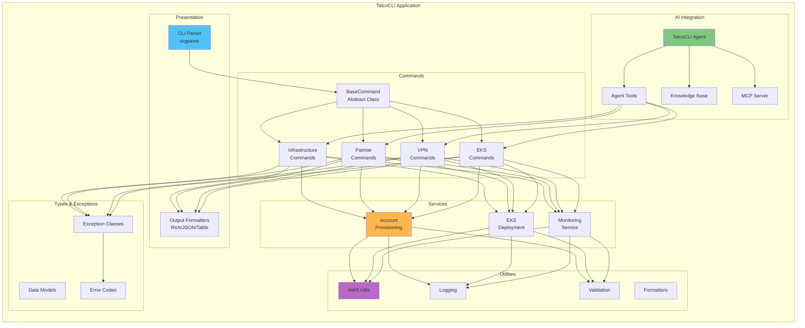
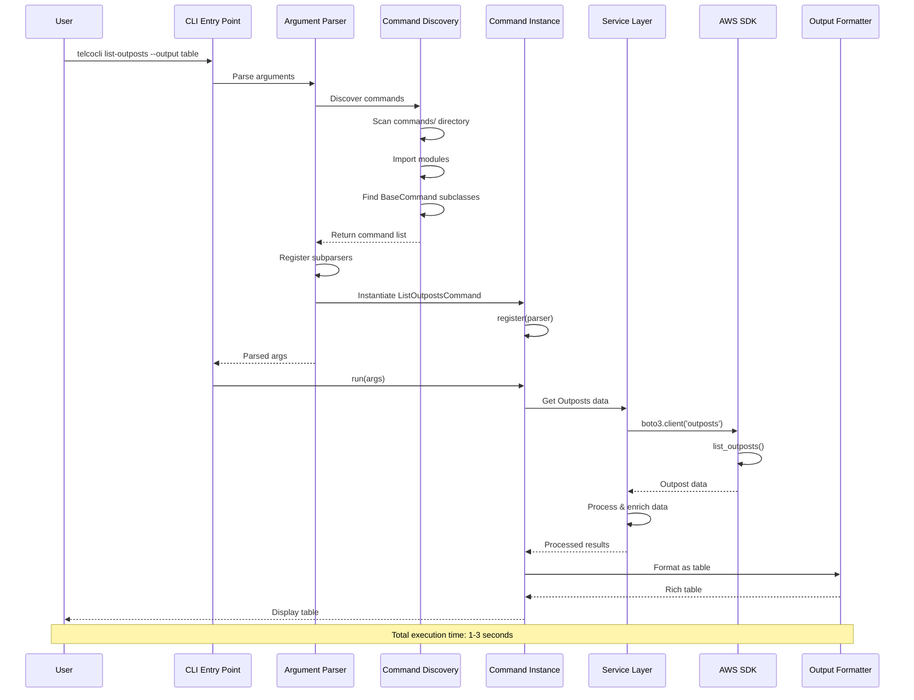
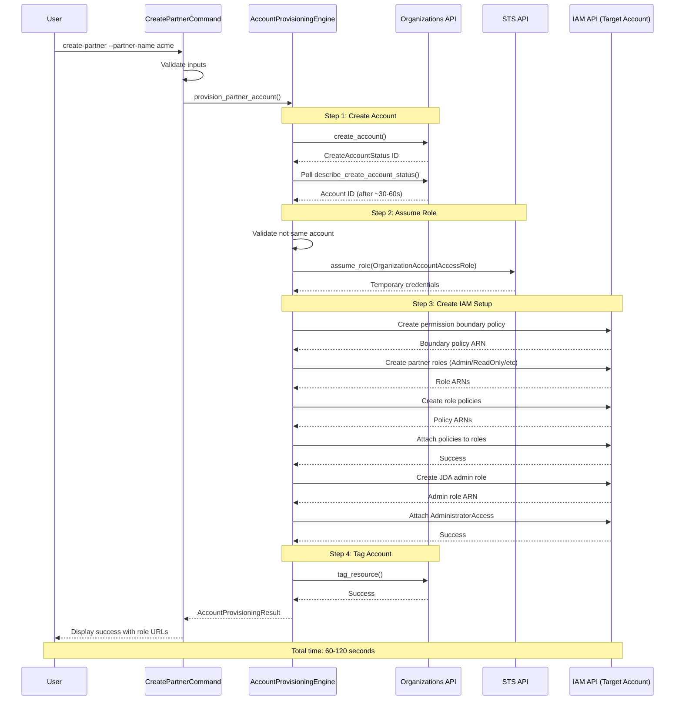
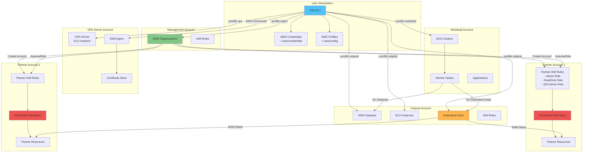
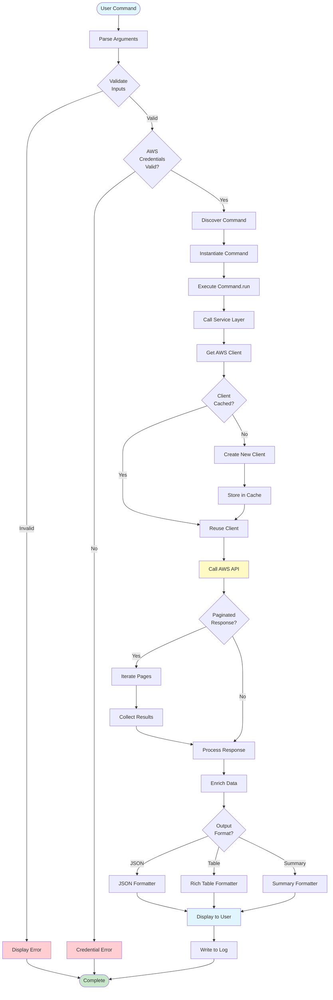
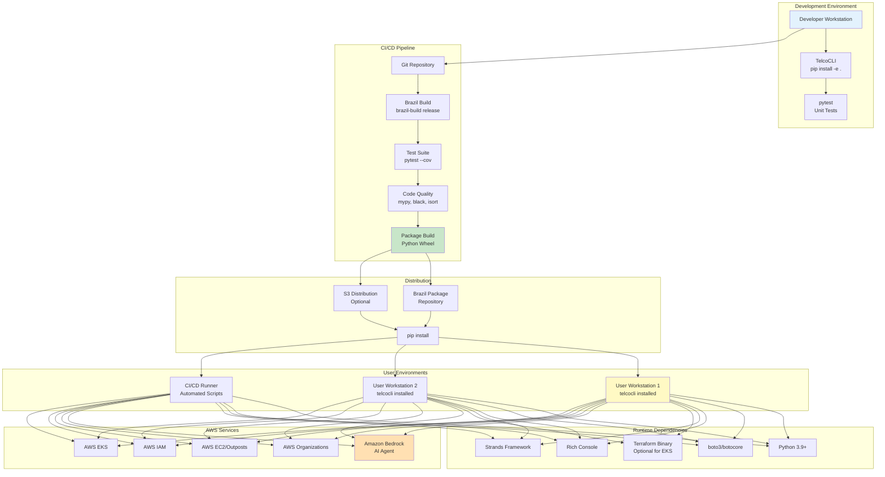
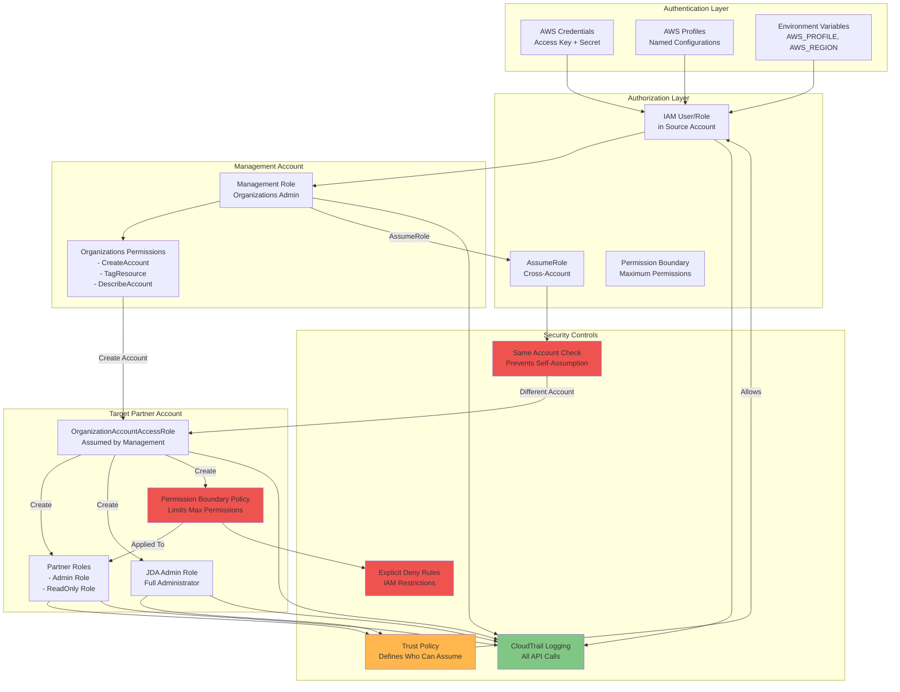
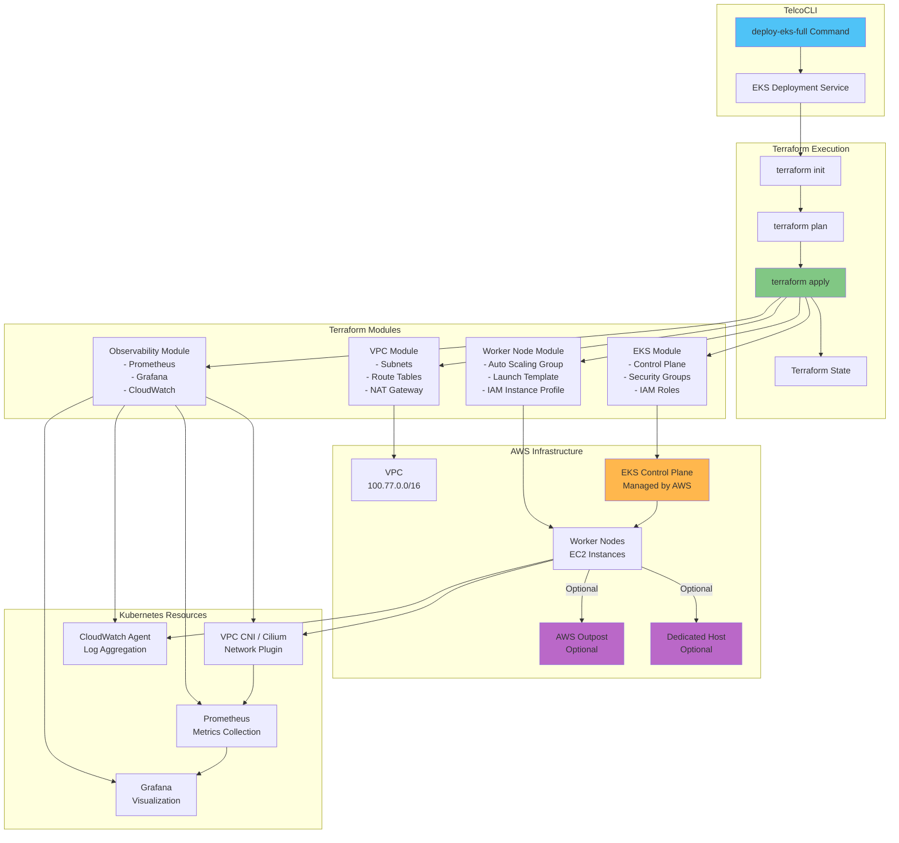
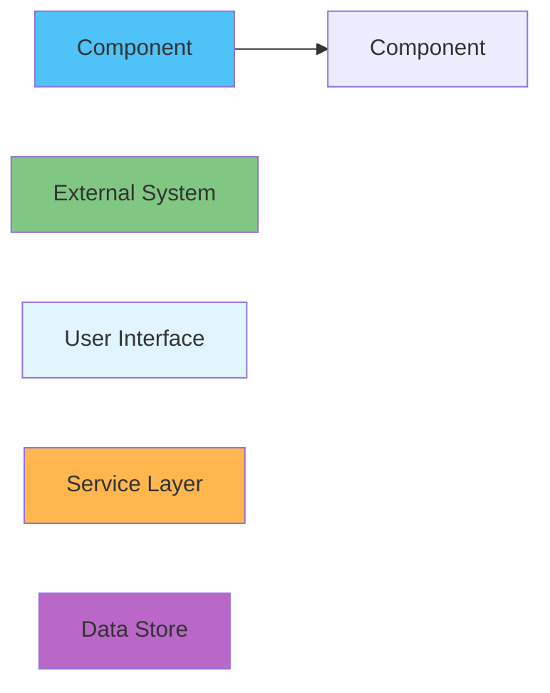

# TelcoCLI System Architecture Diagrams

This document contains comprehensive system architecture diagrams for TelcoCLI.

## Table of Contents
1. [High-Level System Architecture](#1-high-level-system-architecture)
2. [Component Architecture](#2-component-architecture)
3. [Command Execution Flow](#3-command-execution-flow)
4. [Account Provisioning Flow](#4-account-provisioning-flow)
5. [AI Agent Integration](#5-ai-agent-integration)
6. [Multi-Account Architecture](#6-multi-account-architecture)
7. [Data Flow Diagram](#7-data-flow-diagram)
8. [Deployment Architecture](#8-deployment-architecture)

---

## 1. High-Level System Architecture



---

## 2. Component Architecture



---

## 3. Command Execution Flow



---

## 4. Account Provisioning Flow



---

## 5. AI Agent Integration

```mermaid
graph TB
    subgraph "User Interaction"
        USER[User Query:<br/>"list outposts in us-west-2"]
    end
    
    subgraph "AI Agent Layer"
        AGENT[TelcoCLI Agent<br/>Strands Framework]
        SESSION[Session Manager<br/>Conversation Context]
        PROMPT[System Prompt<br/>Command Selection Logic]
    end
    
    subgraph "Tool Layer"
        SEARCH[search_commands_tool<br/>Knowledge Base Search]
        EXEC[execute_command_tool<br/>TelcoCLI Execution]
        BASH[enhanced_execute_bash_tool<br/>AWS CLI Fallback]
        DOCS[enhanced_search_aws_docs_tool<br/>Documentation]
    end
    
    subgraph "Knowledge Base"
        KB_CMD[commands.json<br/>21 Commands]
        KB_ERR[aws_errors.json<br/>Error Patterns]
        KB_CACHE[Pre-built Cache<br/>Fast Loading]
    end
    
    subgraph "Execution Layer"
        MCP[MCP Server<br/>Command Executor]
        CLI_EXEC[CLI Commands]
        AWS_CLI[AWS CLI]
    end
    
    subgraph "External Services"
        BEDROCK[Amazon Bedrock<br/>Claude 4]
        AWS_API[AWS APIs]
    end
    
    USER --> AGENT
    AGENT --> SESSION
    AGENT --> PROMPT
    AGENT --> BEDROCK
    
    PROMPT --> SEARCH
    SEARCH --> KB_CMD & KB_ERR & KB_CACHE
    
    SEARCH -->|Command Found| EXEC
    SEARCH -->|No Command| BASH
    
    EXEC --> MCP
    MCP --> CLI_EXEC
    CLI_EXEC --> AWS_API
    
    BASH --> AWS_CLI
    AWS_CLI --> AWS_API
    
    AGENT --> DOCS
    
    AWS_API -->|Response| AGENT
    AGENT -->|Formatted Answer| USER
    
    style USER fill:#e3f2fd
    style AGENT fill:#c8e6c9
    style BEDROCK fill:#fff9c4
    style KB_CMD fill:#f3e5f5
    style MCP fill:#ffe0b2
```

---

## 6. Multi-Account Architecture



---

## 7. Data Flow Diagram



---

## 8. Deployment Architecture



---

## 9. Security Architecture



---

## 10. EKS Deployment Architecture



---

## Diagram Usage Guide

### For System Design Interviews
- Start with **Diagram 1** (High-Level Architecture) for overview
- Use **Diagram 3** (Command Execution Flow) to explain request handling
- Reference **Diagram 6** (Multi-Account Architecture) for scalability discussion

### For Technical Documentation
- **Diagram 2** (Component Architecture) shows module organization
- **Diagram 7** (Data Flow) explains processing pipeline
- **Diagram 9** (Security Architecture) documents security controls

### For Onboarding New Developers
- Begin with **Diagram 1** for system overview
- Study **Diagram 2** for code organization
- Review **Diagram 3** for understanding execution flow

### For Operations Teams
- **Diagram 8** (Deployment Architecture) for installation
- **Diagram 6** (Multi-Account Architecture) for AWS setup
- **Diagram 10** (EKS Deployment) for Kubernetes operations

---

## Legend



- **Blue** (#4fc3f7): Core application components
- **Green** (#81c784): External AWS services
- **Light Blue** (#e1f5ff): User-facing interfaces
- **Orange** (#ffb74d): Service layer components
- **Purple** (#ba68c8): Infrastructure/utilities
- **Red** (#ef5350): Security controls/boundaries

